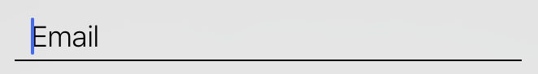

# UnderlineTextField
A custom UITextField with an underline spanning the length of the view and a small indent for stylistic purposes.

## How to use:

1. Copy UnderlineTextField.swift into your project
2. Drag and drop a UITextField into your Storyboard
3. Change the class type to UnderlineTextField
